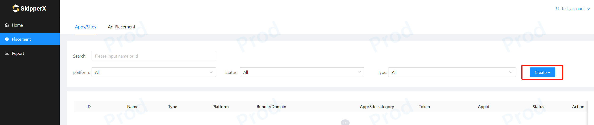
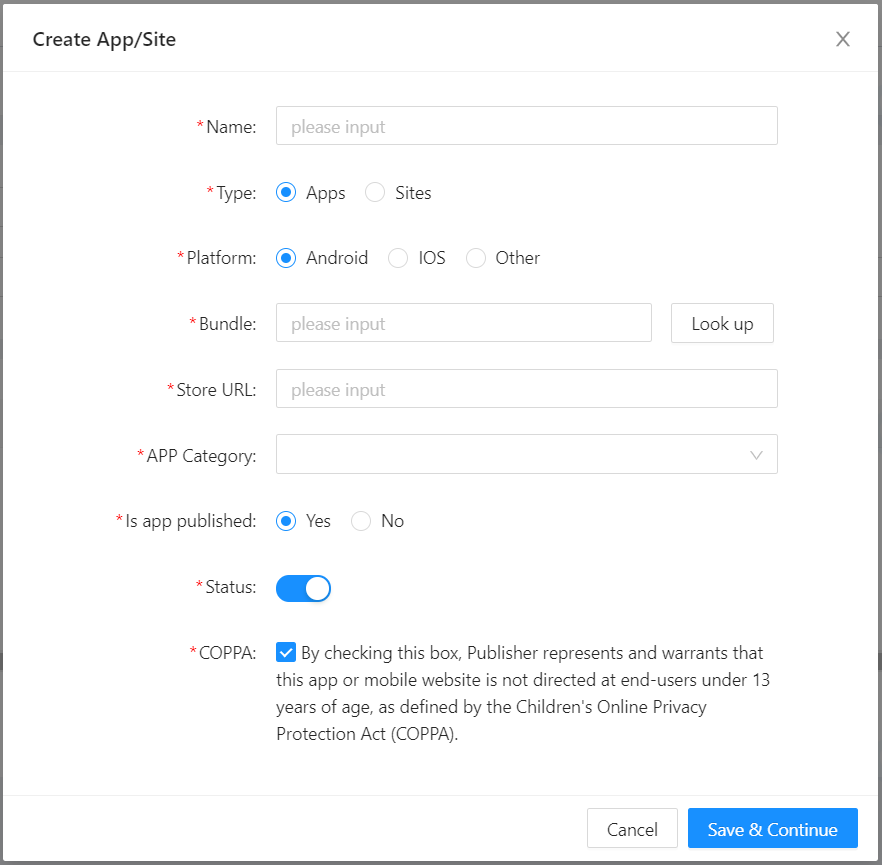
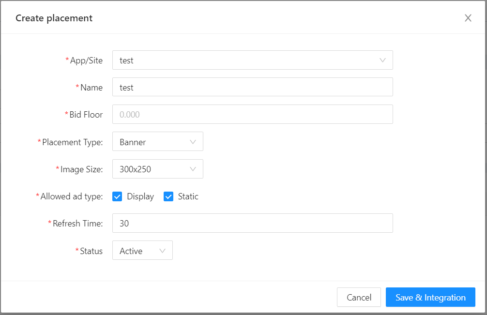
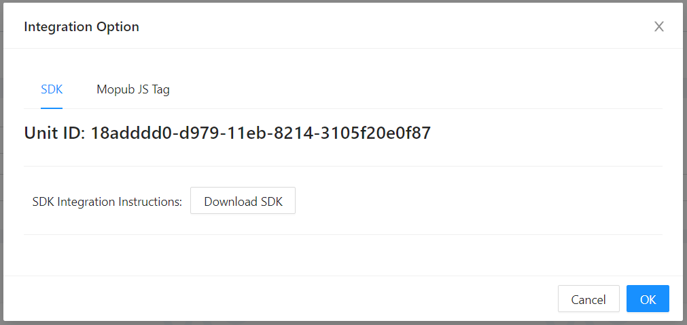
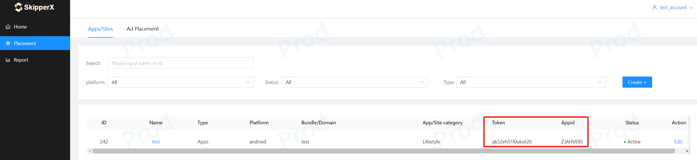

# SkipperX SDK入门指南
欢迎您选择SkipperX SDK对接合作，这篇文档将指引您如何操作开发者后台并对接我们的SDK开始您的广告变现，如果您有任何问题请联系您的客户经理。
### 创建账号
请联系您的客户经理为您创建SkipperX 开发者账号。
### 创建APP和广告位
1. 进入开发者后台后，您需要先为您的账号创建APP/Site及其Placement.

2. 进入新建弹窗，输入您APP的相关信息, 填写的字段释义如下



> Type: 流量类型是APP流量还是Web Site流量；
> Platform：APP的系统平台，是Android还是IOS，如果是Windows之类的请选择其他；
> Bundle：APP的包名；（如果您的Android APP已上架，填写包名后点击Look up，将自动填充Store URL和APP Category）
> Store URL：APP上架商店的详情页链接；
> Domain：Site的域名；
> App Categroy：APP的分类；
> Is app published：您的APP是否已上架；
> Status：APP/Site的状态，如果状态为关，其Appid和token将不再生效；
> COPPA：如果您的APP/Site遵守COPPA，请勾选上；
> TOKEN和Appid：为对接SDK时的验证密钥，新建APP后，自动生成。

3. 完成APP/Site的填写后，保存继续为其创建广告位，填写的字段释义如下


> App/Site：当前创建广告位的归属，一个App/Site可以拥有多个广告位；
> Name：广告位的名称，一般可以命名为"APPNAME_TYPE_SIZE"；
> Bid Floor：广告位的底价，只有高于这个底价的广告才会填充；
> Placement Type：广告位类型，Banner, Native, Interstitial, Rewarded Ad；
> Size：广告位尺寸；
> Allowed Ad Type：支持填充的广告类型；Display(HTML), Static, VAST Video, Playable；
> Refresh Time：Banner广告自动刷新时间；
> Muting：视频广告是否默认静音；
> Allow Skip：允许跳过的时间，单位为秒；
> CTA Popup：是否在视频播放过程中弹出CTA按钮，一般能够提升CTR，但是可能遮罩视频元素；
> Status：广告位状态，状态为关时，广告位将不再请求广告；

### 集成SkipperX SDK
保存广告位后，就可以进入集成SDK的环节。SkipperX SDK支持Android，IOS，Unity, Cocos。同时如果您对接了Mopub聚合SDK，我们也只支持Mopub JS Tag作为自定义网盟接入。如果你是Site流量，也可以直接部署我们的JS Tag


### 报表说明
跑出数据后，可以通过报表查看收益数据情况，以下是维度指标的说明


> 维度
> Date：日期
> App/Site：APP或者是Site
> Placement：广告位
> Country：国家
> 指标
> Impression：广告展示
> Clicks：广告点击
> CTR：广告点击率，Clicks/Impression
> eCPM：每千次展示单价，Revenue/Impression*1000
> Revenue：广告收益
# Android SDK
### 添加依赖和初始化
添加依赖

```
dependencies {

}

//

allprojects {
    repositories {
        maven {url "http://maven.skipperx.net/repository/maven-public/"}
    }
}
```

初始化SDK
```
public class MainActivity extends AppCompatActivity {

    @Override
    protected void onCreate(@Nullable Bundle savedInstanceState) {
        super.onCreate(savedInstanceState);
        setContentView(R.layout.activity_main);

        String appId = "xxxxxxxx"; //申请时的appid
        String token = "xxxxxxxxxxxxxxxx"; //申请时的token

        SkipperXAdSDK.initialize(getApplication(), appId, token);
    }

}
```

初始化SDK时，需要传入APP的appid和token，这两个值可以在你的账户后台Placement管理页面中找到



### 广告位类型
#### Banner
* 使用Banner广告，需要向布局中添加BannerAdView
```
# main_activity.xml
    ···
    <com.skipperx.sdk.ui.BannerAdView
        android:id="@+id/banner"
        android:layout_width="match_parent"
        android:layout_height="match_parent"
        app:banner_size="small_size"/>
    ···
```
app:banner_size：将此属性设置为要使用的广告尺寸。提供了2种类型的banner尺寸：small_size (320x50) 和 big_size (300x250)。不设置默认为big_size (300x250)。
布局中需给广告位设置 match_parent。

MainActivity中，需要设置广告的unitid，并且调用loadAd()，展示广告。
```
public class MainActivity extends AppCompatActivity {

    @Override
    protected void onCreate(@Nullable Bundle savedInstanceState) {
        super.onCreate(savedInstanceState);
        setContentView(R.layout.activity_main);

        String appId = "xxxxxxxx"; //申请时的appid
        String token = "xxxxxxxxxxxxxxxx"; //申请时的token

        SkipperXAdSDK.initialize(getApplication(), appId, token);

        BannerAdView bannerAdView = findViewById(R.id.banner);
        bannerAdView.setAdUnitId("xxxxxxx");
        bannerAdView.loadAd();
    }

}
```
* 需要监听广告相关回调事件，在相关的AdView添加Listener。
1. 加载监听
```
        bannerAdView.setAdLoadListener(new AdLoadListener() {
            @Override
            public void onAdSucLoad(AdContent adContent) {
                //广告加载成功
            }

            @Override
            public void onAdFailLoad() {
                //广告加载失败
            }
        });
```
2. 展示监听
```
        bannerAdView.setAdShowListener(new AdShowListener() {
            @Override
            public void onAdShowed() {
                //展示广告
            }

            @Override
            public boolean onAdClicked() {
                return false;  //点击拦截  false：不拦截后续事件；true：拦截
            }

            @Override
            public void onAdClosed() {
                //关闭广告
            }
        });
```

#### Native
native显示样式由用户自定义，但需要调用NativeAdLayout使用做处理，其中媒体用MediaView加载。NativeAdLayout为FrameLayout。
* 向布局中添加NativeAdLayout和MediaView

```
# main_activity.xml
<androidx.constraintlayout.widget.ConstraintLayout xmlns:android="http://schemas.android.com/apk/res/android"
    android:layout_width="match_parent"
    android:layout_height="match_parent"
    xmlns:app="http://schemas.android.com/apk/res-auto">
    <FrameLayout
        android:id="@+id/my_content"
        android:layout_width="match_parent"
        android:layout_height="wrap_content"
        app:layout_constraintTop_toTopOf="parent"/>

</androidx.constraintlayout.widget.ConstraintLayout>
```
```
# native_view.xml
    ···
    <com.skipperx.sdk.ui.NativeAdLayout
        android:id="@+id/container"
        android:layout_width="match_parent"
        android:layout_height="wrap_content">

        <androidx.constraintlayout.widget.ConstraintLayout
            android:layout_width="match_parent"
            android:layout_height="match_parent">
            ···
            <com.skipperx.sdk.ui.MediaView
                android:id="@+id/media"
                android:layout_width="match_parent"
                android:layout_height="0dp"
                app:layout_constraintDimensionRatio="w,9:16"
                app:layout_constraintTop_toTopOf="parent" />
            ···
        </androidx.constraintlayout.widget.ConstraintLayout>

    </com.skipperx.sdk.ui.NativeAdLayout>
    ···
```
MediaView需要设置宽高比例。


```
public class MainActivity extends AppCompatActivity {

    private NativeAdLayout adView;
    @Override
    protected void onCreate(@Nullable Bundle savedInstanceState) {
        super.onCreate(savedInstanceState);
        setContentView(R.layout.activity_main);

        String appId = "xxxxxxxx"; //申请时的appid
        String token = "xxxxxxxxxxxxxxxx"; //申请时的token

        SkipperXAdSDK.initialize(getApplication(), appId, token);

        nativeAdView = findViewById(R.id.container);
        String adUnitId = "xxxxxxxxx";

        NativeAd nativeAd = new NativeAd(adUnitId, this);
        NativeAdLoadListener nativeAdLoadListener = new NativeAdLoadListener() {
                    @Override
                    public void onAdSucLoad(NativeData nativeData) {
                        FrameLayout frameLayout = findViewById(R.id.my_content);
                        adView = (NativeAdLayout) getLayoutInflater().inflate(R.layout.native_big_static, null);
                        adView.setTitle(adView.findViewById(R.id.ad_tv_title));
                        adView.setDescribe(adView.findViewById(R.id.ad_tv_desc));
                        adView.setButton(adView.findViewById(R.id.ad_button));
                        adView.setContainer(adView.findViewById(R.id.ad_container));
                        adView.setMedia(adView.findViewById(R.id.ad_media_big));
                        adView.setIcon(adView.findViewById(R.id.ad_iv_icon));
                        adView.setAdShowListener(new AdShowListener() {
                            @Override
                            public void onAdShowed() {

                            }

                            @Override
                            public boolean onAdClicked() {
                                return false;
                            }

                            @Override
                            public void onAdClosed() {

                            }
                        });
                        nativeAd.setNativeAdLayout(adView);
                        frameLayout.removeAllViews();
                        frameLayout.addView(adView);
                    }

                    @Override
                    public void onAdFailLoad() {

                    }
                };
                nativeAd.setAdListener(nativeAdLoadListener);
                nativeAd.loadAd();
    }

    @Override
    protected void onPause() {
        super.onPause();
        if (adView!=null){
            adView.pause();
        }
    }

    @Override
    protected void onResume() {
        super.onResume();
        if (adView!=null){
            adView.resume();
        }
    }

    @Override
    protected void onDestroy() {
        super.onDestroy();
        if (adView!=null){
            adView.destroy();
        }
    }
}
```
布局元素获取必须在成功的时候绑定，处理完布局后需要调用setNativeAdLayout方法展示广告，否则无反应。

由于native广告存在video类型的广告，需要在Activity生命周期中对应添加广告的生命周期回调，否则播放器可能会异常。

* 广告事件
1. 加载监听
```
        setAdListener(new NativeAdLoadListener() {
                    @Override
                    public void onAdSucLoad(NativeData nativeData) {
                       //广告加载成功
                    }

                    @Override
                    public void onAdFailLoad() {
                        //广告加载失败
                    }
                })
```

2. 展示监听

```
                    adView.setAdShowListener(new AdShowListener() {
                            @Override
                            public void onAdShowed() {
                                //展示广告
                            }

                            @Override
                            public boolean onAdClicked() {
                                return false; //点击拦截  false：不拦截后续事件；true：拦截
                            }

                            @Override
                            public void onAdClosed() {
                                //关闭广告
                            }
                        });
```

> 注意： 处理完布局后需要调用showAd方法展示广告，否则无反应；成功加载广告后才能添加展示监听。

#### Interstitial

```
public class MainActivity extends AppCompatActivity {

    private InterstitialAd adLoader;
    @Override
    protected void onCreate(@Nullable Bundle savedInstanceState) {
        super.onCreate(savedInstanceState);
        setContentView(R.layout.activity_main);

        String appId = "xxxxxxxx"; //申请时的appid
        String token = "xxxxxxxxxxxxxxxx"; //申请时的token

        SkipperXAdSDK.initialize(getApplication(), appId, token);

        adLoader = new InterstitialAd(this);

        adLoader.setUnitId(adUnitId);
        adLoader.setAdShowListener(new AdShowListener() {
            @Override
            public void onAdShowed() {
                Log.d("INTERSTITIAL","onAdShowed");
            }

            @Override
            public boolean onAdClicked() {
                return false;
            }

            @Override
            public void onAdClosed() {

            }
        });
        adLoader.setAdListener(new AdLoadListener() {
            @Override
            public void onAdSucLoad(AdContent adContent) {
                if (adLoader.isLoaded()){
                    adLoader.showAd(InterstitialLanActivity.this);
                }
            }

            @Override
            public void onAdFailLoad() {

            }
        });
        adLoader.loadAd();
    }

}
```

> 注意：插屏广告需要注册回调监听且在onAdSucLoad中调用showAd方法展示广告，或者自定义触发showAd；当请求成功后，isLoaded()为true

* 广告事件
1. 加载监听
```
        setAdListener(new AdLoadListener() {
                    @Override
                    public void onAdSucLoad(AdContent adContent) {
                       //广告加载成功
                    }

                    @Override
                    public void onAdFailLoad() {
                        //广告加载失败
                    }
                })
```

2. 展示监听

```
        interstitialAdView.setAdShowListener(new AdShowListener() {
            @Override
            public void onAdShowed() {
                //展示广告
            }

            @Override
            public boolean onAdClicked() {
                return false;  //点击拦截  false：不拦截后续事件；true：拦截
            }

            @Override
            public void onAdClosed() {
                //关闭广告
            }
        });
```

#### 激励视频
```
public class RewardedActivity extends AppCompatActivity {

    RewardedAd rewardedAd;

    @Override
    protected void onCreate(@Nullable Bundle savedInstanceState) {
        super.onCreate(savedInstanceState);
        setContentView(R.layout.rewarded_test);
        Map<String, String> map = new HashMap<>();
        map.put("customer_id", "1234567");
        map.put("unique_id", "uihj89uijkbn7uy8");
        map.put("reward_type", "add_coins");
        map.put("reward_value", "2");
        map.put("verifier", "tyuidjkol");
        map.put("extinfo", "{'self define':'xxx'}");
        rewardedAd = new RewardedAd(this);
        rewardedAd.setAdUnitId("d95c3300-bd00-11eb-8f70-6d1821a44678");
        rewardedAd.setRequestParams(map);
        AdLoadListener adLoadCallBack = new AdLoadListener() {
            @Override
            public void onAdSucLoad(AdContent adContent) {
                rewardedAd.showAd(RewardedActivity.this);
            }

            @Override
            public void onAdFailLoad() {

            }
        };
        rewardedAd.setAdListener(adLoadCallBack);
        rewardedAd.loadAd();
        RewardedAdCallback adCallback = new RewardedAdCallback() {
            @Override
            public void onRewardedAdOpened() {

            }

            @Override
            public void onRewardedAdClosed() {

            }

            @Override
            public void onUserEarnedReward() {

            }

            @Override
            public void onRewardedAdFailedToShow() {

            }

            @Override
            public boolean onAdClicked() {
                return false;
            }
        };
        rewardedAd.setRewardedAdCallback(adCallback);


    }

}
```

需要在加载成功后，调用showAd展示广告，确保广告是已经加载完成了。
加载激励广告前。需要传入激励广告的相关信息（以上是测试数据）

|  字段名称   | 类型  |  取值（举例）  |  说明  |字段名称|
|  ----  | ----  | |||
| customer_id  | string |1234567|受激励的客户id|可选|
| unique_id  | string |uihj89uijkbn7uy8|激励的唯一id|可选|
|  reward_type   | 激励类型|add_coins|激励的类型，开发者自定义|可选|
|  reward_value  | 激励值  |2|激励的值，开发者自定义|可选|
| verifier  | 验证码 |tyuidjkol|接入方生产的验证码，用于回调链的验证|可选|
| extinfo  | 额外信息 |{"self define":"xxx"}|接入方自定义||

* 广告事件
1. 加载监听
```
	   AdLoadListener adLoadCallBack = new AdLoadListener() {
            @Override
            public void onAdSucLoad(AdContent adContent) {
                rewardedAd.showAd(RewardedActivity.this);
            }

            @Override
            public void onAdFailLoad() {

            }
        };
```

2. 展示监听

```
		RewardedAdCallback adCallback = new RewardedAdCallback() {
            @Override
            public void onRewardedAdOpened() {
                //激励视频播放
            }

            @Override
            public void onRewardedAdClosed() {
                //关闭激励视频
            }

            @Override
            public void onUserEarnedReward() {
                //获取奖励
            }

            @Override
            public void onRewardedAdFailedToShow() {
                //视频播放失败
            }

            @Override
            public boolean onAdClicked() {
                return false;
                //点击拦截  false：不拦截后续事件；true：拦截
            }
        };
```

### 竞价
SDK支持竞价功能
```
//banner
bannerAdView.bidding(adUnitId, new AdBiddingListener() {
   @Override
   public void getBidding(float price, String token) {

   }
});

//native
NativeAd nativeAd = new NativeAd(adUnitId, this);
nativeAd.bidding(new AdBiddingListener() {
   @Override
   public void getBidding(float price, String token) {

   }
});

//interstitial
interstitialAd = new InterstitialAd(this);
interstitialAd.bidding(adUnitId,new AdBiddingListener() {
   @Override
   public void getBidding(float price, String token) {

   }
})；

//rewarded
RewardedAd rewardedAd = new RewardedAd(this);
rewardedAd.setRequestParams(map);  //map为激励广告参数
rewardedAd.bidding(adUnitId,new AdBiddingListener() {
   @Override
   public void getBidding(float price, String token) {

   }
});
```
竞价后会返回广告价格price，开发者可根据价格决定是否需要广告，如需要广告需要调用winBidding，并且把竞价成功的广告token作为参数传递。

```
//banner
bannerAdView.winBidding(token);

//native
nativeAd.winBidding(token);

//interstitial
interstitialAd.winBidding(token);

//rewarded
rewardedAd.winBidding(token);
```
竞价成功后，展示广告时需要调用loadAd(token)。注意：不需要再调用show方法展示。
```
//banner
bannerAdView.loadAd(token);

//native
nativeAd.loadAd(token);

//interstitial
interstitialAd.loadAd(token);

//rewarded
rewardedAd.loadAd(token);
```


### 更多说明

####  注意事项
1、接入时需对app开启存储权限后才可以正常下载广告配置的apk，否则部分手机将无下载反应。
2、混淆时，需添加 -keep class com.skipperx.sdk.response.* {*;} ，否则将无数据返回。
3、native布局添加元素时，需要在loadAd方法之前添加，否则无法正常显示。
4、插屏广告需要注册回调监听且在onAdLoaded中调用showAd方法展示广告，否则将无法正常显示广告

# 广告响应参数说明
广告日志TAG：adReq
### 返回参数列表

| 参数名 | 类型 | 说明 |
| ------------ | ------------ |
| unitid | string | 广告位id |
| title | string | 标题 |
| desc | string | 描述 |
| ad_btn|string|按钮文案|
| image|object|图片object|
| icon|object|icon object|
| video|object|video object|
| app_icon|string|被推广的app的图标|

**Icon & 图片**


| 参数 | 类型 | 说明 |
| ------------ | ------------ |
| url | string | 资源链接 |
| h | int | 高 |
| w | int | 宽 |

**视频**

|参数|类型|说明|
|:---|:---|
|url|string|资源链接|
|h|int|高|
|w|int|宽|
|size|int|视频大小|
|duration|int|视频时长|
|ad_btn_jump_type|int| 跳转类型 |


### 异常状态码
|状态码（status）| 说明 |描述（msg)|
|:-----|:-----|
|40003|签名验证失败 |not validate|
|40101|广告位不存在|Not bidding:tagid not actived|
|40102|adx 流控|request next time please|
|40103|没有匹配的广告返回|no ads from all dsps|
|40201 | 参数错误|empty appid or sign|